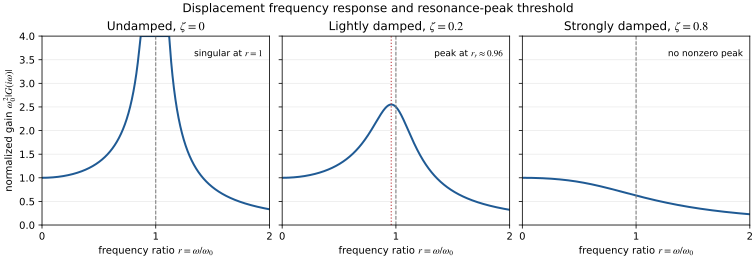

# Natural, Damped, and Resonant Frequencies in Second-Order Systems

Second-order systems use several related frequency terms that describe
different phenomena. The **undamped natural frequency** describes the system's
baseline oscillatory scale, the **damped natural frequency** describes
decaying transient oscillations, and the **resonance frequency** describes a
peak in the steady-state response to sinusoidal forcing.

These frequencies may be numerically close when damping is small, but they are
not interchangeable.

## 1. Standard second-order model

Consider the normalized second-order system

$$
\ddot{q}+2\zeta\omega_0\dot{q}+\omega_0^2q=u,
$$

where:

- $\omega_0>0$ is the undamped natural frequency in rad/s;
- $\zeta\geq0$ is the damping ratio; and
- $u(t)$ is an external input.

With zero initial conditions, the transfer function from $u$ to $q$ is

$$
G(s)=\frac{Q(s)}{U(s)}
=\frac{1}{s^2+2\zeta\omega_0s+\omega_0^2}.
$$

The formulas below assume this displacement-like output and a constant
numerator. Other outputs, such as velocity or acceleration, can have different
frequency-response peaks.

## 2. Undamped and damped natural frequencies

The poles are the roots of the characteristic equation

$$
s^2+2\zeta\omega_0s+\omega_0^2=0.
$$

For the underdamped case $0<\zeta<1$,

$$
s_{1,2}
=-\zeta\omega_0
\pm i\omega_0\sqrt{1-\zeta^2}.
$$

This motivates the **damped natural frequency**

$$
\boxed{\omega_d=\omega_0\sqrt{1-\zeta^2}}.
$$

The free response has the form

$$
q_{\mathrm{transient}}(t)
=e^{-\zeta\omega_0t}
\left(C_1\cos(\omega_dt)+C_2\sin(\omega_dt)\right).
$$

Thus:

- $\omega_d$ is the frequency of the decaying transient oscillation;
- $\zeta\omega_0$ is the exponential decay rate; and
- $\omega_0$ is the corresponding frequency when damping is removed.

When $\zeta=0$, the oscillation is undamped and
$\omega_d=\omega_0$. When $\zeta\geq1$, the poles are real and there is no
oscillatory transient, so the usual real-valued $\omega_d$ interpretation no
longer applies.

## 3. Resonance belongs to the forced response

For a sinusoidal input $u(t)=U\sin(\omega t)$, the steady-state output has
the same input frequency:

$$
q_{\mathrm{steady-state}}(t)
=A(\omega)\sin(\omega t+\phi(\omega)).
$$

The amplitude ratio is the frequency-response magnitude

$$
|G(i\omega)|
=\frac{1}{
\sqrt{(\omega_0^2-\omega^2)^2
+(2\zeta\omega_0\omega)^2}}.
$$

The **resonance frequency** $\omega_r$, when it exists as a nonzero peak, is
the input frequency that maximizes this magnitude. It describes forced
steady-state behavior, not the frequency of the decaying transient.

### Derivation of the resonance-frequency formula

To maximize $\lvert G(i\omega)\rvert$, minimize its squared denominator.
Define the dimensionless frequency ratio

$$
r=\frac{\omega}{\omega_0}.
$$

Ignoring the constant factor $\omega_0^4$, the squared denominator is

$$
D(r)
=(1-r^2)^2+4\zeta^2r^2
=1+(4\zeta^2-2)r^2+r^4.
$$

Differentiate with respect to $r$:

$$
\frac{dD}{dr}
=4r\left(r^2+2\zeta^2-1\right).
$$

Apart from the zero-frequency point $r=0$, the stationary point is

$$
r^2=1-2\zeta^2.
$$

A positive stationary frequency exists only when
$\zeta<1/\sqrt{2}$. Therefore, for the displacement transfer function
above,

$$
\boxed{\omega_r=\omega_0\sqrt{1-2\zeta^2}},
\qquad
0\leq\zeta<\frac{1}{\sqrt{2}}.
$$

For $\zeta\geq1/\sqrt{2}$, the response has no nonzero resonance peak; its
largest displacement gain occurs at zero frequency. At $\zeta=0$, the ideal
model has an infinite gain at $\omega=\omega_0$, which is the mathematical
resonance of an undamped oscillator.

The three panels below show the same normalized displacement gain for
representative damping ratios. The vertical dashed line marks $r=1$, while
the dotted line in the lightly damped panel marks the nonzero resonance peak.
The strongly damped example uses $\zeta=0.8$: it is not overdamped in the
time-domain pole classification, but it is already above the
$1/\sqrt{2}$ threshold for a displacement resonance peak.

*The undamped curve is singular at $r=1$; its plotted height is clipped only
to keep the comparison readable.*

The formula is therefore not a universal property of every second-order
quantity. It depends on the chosen input-output transfer function and on the
damping range.

## 4. Comparing the three frequencies

For the standard displacement response:

| Quantity | Meaning | Condition |
| --- | --- | --- |
| $\omega_0$ | Undamped natural frequency | Defined by the denominator |
| $\omega_d$ | Decaying transient oscillation frequency | $0<\zeta<1$ |
| $\omega_r$ | Nonzero steady-state displacement-gain peak | $0\leq\zeta<1/\sqrt{2}$ |

For small positive damping,

$$
\omega_r
=\omega_0\sqrt{1-2\zeta^2}
<
\omega_d
=\omega_0\sqrt{1-\zeta^2}
<
\omega_0.
$$

For example, with $\zeta=0.2$,

$$
\omega_d\approx0.980\,\omega_0,
\qquad
\omega_r\approx0.959\,\omega_0.
$$

They are close numerically, but one belongs to the transient poles and the
other belongs to the forced-response gain curve.

## 5. Total response to a sinusoidal input

The response to a sinusoidal input is the sum of transient and steady-state
parts:

$$
q(t)
=q_{\mathrm{transient}}(t)
+q_{\mathrm{steady-state}}(t).
$$

The transient part depends on initial conditions and decays when
$\zeta>0$. It oscillates at $\omega_d$. The steady-state part remains after
the transient has decayed and oscillates at the input frequency $\omega$.

Consequently:

- a Bode magnitude plot describes the steady-state response as $\omega$
  varies;
- a step or impulse response shows transient ringing governed by
  $\omega_d$; and
- a large Bode peak near $\omega_r$ does not mean that the transient itself
  oscillates at $\omega_r$.

## 6. Why exact undamped resonance grows

The frequency-response discussion explains where the forced response peaks. The
undamped case has an additional feature: at exact resonance, the response is
not a bounded sinusoid. It contains a term proportional to
$t\sin(\omega_n t)$, where

$$
\omega_n=\sqrt{\frac{k}{m}}=\omega_0.
$$

The same term can be derived in three equivalent ways.

### 6.1 ODE view: the resonant trial is not independent

Consider the undamped forced oscillator

$$
m\ddot{x}+kx=F_0\cos(\omega t).
$$

Its homogeneous solution at $\omega=\omega_n$ is

$$
x_h=C_1\cos(\omega_nt)+C_2\sin(\omega_nt).
$$

Away from resonance, a sinusoidal particular trial is linearly independent
from the homogeneous solution. At $\omega=\omega_n$, however,

$$
x_p=A\cos(\omega_nt)+B\sin(\omega_nt)
$$

is already in the homogeneous solution space. The differential operator maps
this trial to zero, so it cannot reproduce the forcing.

Multiplying the trial by $t$ creates a generalized independent trial. For
cosine forcing, choose

$$
x_p=Ct\sin(\omega_nt).
$$

Substitution into the ODE gives

$$
m\left(2C\omega_n\cos(\omega_nt)\right)
=F_0\cos(\omega_nt),
$$

so

$$
C=\frac{F_0}{2m\omega_n}.
$$

Therefore the resonant particular solution is

$$
\boxed{x_p(t)=\frac{F_0}{2m\omega_n}t\sin(\omega_nt)}.
$$

The growing envelope comes from the duplicated forcing and homogeneous mode,
not from a new ordinary sinusoidal steady state.

### 6.2 State-space view: convolution accumulates aligned input

Define the mechanical state

$$
\xi=
\begin{bmatrix}x\\\dot{x}\end{bmatrix},
\qquad
\dot{\xi}=A\xi+Bu,
$$

with

$$
A=
\begin{bmatrix}
0&1\\\\
-\omega_n^2&0
\end{bmatrix},
\qquad
B=
\begin{bmatrix}
0\\\\
1/m
\end{bmatrix}.
$$

The complete state response separates into zero-input and zero-state parts:

$$
\xi(t)
=e^{At}\xi(0)
+\int_0^t e^{A(t-\tau)}Bu(\tau)\,d\tau.
$$

For the oscillator,

$$
e^{At}
=
\begin{bmatrix}
\cos(\omega_nt)&\frac{1}{\omega_n}\sin(\omega_nt)\\\\
-\omega_n\sin(\omega_nt)&\cos(\omega_nt)
\end{bmatrix}.
$$

With $u(\tau)=F_0\cos(\omega\tau)$, the displacement component of the
zero-state response is

$$
x_{\mathrm{zs}}(t)
=\frac{F_0}{m\omega_n}
\int_0^t
\sin\!\bigl(\omega_n(t-\tau)\bigr)
\cos(\omega\tau)\,d\tau.
$$

At resonance, $\omega=\omega_n$, the integral becomes

$$
\int_0^t
\sin\!\bigl(\omega_n(t-\tau)\bigr)
\cos(\omega_n\tau)\,d\tau
=\frac{t}{2}\sin(\omega_nt),
$$

and therefore

$$
\boxed{x_{\mathrm{zs}}(t)
=\frac{F_0}{2m\omega_n}t\sin(\omega_nt)}.
$$

This view explains the $t$ factor as coherent accumulation: each input
contribution arrives with a phase that remains aligned with the natural
oscillation.

### 6.3 Augmented-system view: resonance creates a Jordan chain

The sinusoidal force can itself be generated by an internal oscillator:

$$
\dot{u}_1=-\omega u_2,
\qquad
\dot{u}_2=\omega u_1,
\qquad
F(t)=F_0u_1.
$$

Using the augmented state

$$
z=
\begin{bmatrix}x&\dot{x}&u_1&u_2\end{bmatrix}^{T},
$$

the forced problem becomes autonomous:

$$
\dot{z}=A_{\mathrm{aug}}z,
$$

where

$$
A_{\mathrm{aug}}=
\begin{bmatrix}
0&1&0&0\\\\
-\omega_n^2&0&F_0/m&0\\\\
0&0&0&-\omega\\\\
0&0&\omega&0
\end{bmatrix}.
$$

The forcing waveform is now encoded in the initial conditions of $u_1,u_2$,
and the complete response is simply

$$
z(t)=e^{A_{\mathrm{aug}}t}z(0).
$$

Away from resonance, the eigenvalues are

$$
\pm i\omega_n,\qquad \pm i\omega.
$$

At exact resonance, the characteristic polynomial becomes

$$
(\lambda-i\omega_n)^2(\lambda+i\omega_n)^2.
$$

When $F_0\neq0$, the mechanical and forcing oscillators are coupled. Each
repeated eigenvalue then has only one independent eigenvector, so the augmented
matrix is defective and is only **similar** to a Jordan-form matrix.

For a $2\times2$ Jordan block

$$
J=
\begin{bmatrix}
\lambda&1\\\\
0&\lambda
\end{bmatrix},
\qquad
e^{Jt}
=e^{\lambda t}
\begin{bmatrix}
1&t\\\\
0&1
\end{bmatrix}.
$$

The resulting $t e^{\pm i\omega_nt}$ terms combine into real
$t\cos(\omega_nt)$ and $t\sin(\omega_nt)$ terms. This recovers the same
resonant solution as the ODE and convolution derivations.

The repeated eigenvalues alone are not enough: without the forcing coupling,
the repeated oscillators can remain diagonalizable. Defectiveness is the
algebraic signature of the resonant interaction.

### 6.4 One result, three interpretations

| View | What becomes special at resonance | Source of the $t$ factor |
| --- | --- | --- |
| ODE | The ordinary sinusoidal trial duplicates a homogeneous mode | Multiply the trial by $t$ |
| State space | The forcing kernel stays phase-aligned with the input | Convolution accumulates coherently |
| Augmented system | Repeated eigenvalues lose an eigenvector | A Jordan block produces $t e^{\lambda t}$ |

All three descriptions express the same linear phenomenon. They do not imply
that every damped or nonlinear resonance grows without bound. Positive damping
separates the poles from the imaginary axis and produces a bounded
steady-state response.

## 7. Robotics relevance

These distinctions matter when analyzing:

- flexible joints and compliant transmissions;
- vibration after a rapid trajectory change;
- actuator and sensor mounting resonances;
- controller bandwidth and gain selection; and
- trajectory commands that excite lightly damped modes.

A robot can show transient ringing after a step or trajectory update even when
the commanded motion contains no sinusoid. Conversely, a periodic command can
produce a large steady-state response near a resonance peak even though the
system's transient frequency is $\omega_d$.

The frequencies are properties of a model and an input-output choice. Measured
hardware resonances may also shift with payload, configuration, friction,
sampling, and closed-loop controller gains.

## Common confusions

Use the source of the observation to choose the relevant frequency:

| Observation | Relevant quantity | Why |
| --- | --- | --- |
| Poles of the second-order denominator | $\omega_0$ and $\omega_d$ | They determine the free-response modes |
| Ringing after a step or impulse | $\omega_d$ | This is transient behavior |
| Peak in a displacement Bode magnitude plot | $\omega_r$ | This is steady-state forced response |
| Periodic command exciting a flexible mode | Input frequency near $\omega_r$ | The forcing frequency can produce a large finite gain |

Three cautions prevent the most common mistakes:

- The transient pole frequency is $\omega_d$ when damping is present; the
  undamped reference value is $\omega_0$.
- A step response primarily reveals $\omega_d$, not directly $\omega_r$.
- The formula for $\omega_r$ assumes the standard displacement transfer
  function. Changing the output or adding zeros changes the frequency at which
  the magnitude peaks.

Positive damping makes the ideal steady-state sinusoidal gain finite. A lightly
damped system can still have a large finite peak and require careful excitation
avoidance.

## Related material

- [Stability from trace and determinant](stability-trace-determinant.md)
- [Dominant eigenvalues and qualitative behavior](dominant-eigenvalues-qualitative-behavior-linear-systems.md)
- [Linear systems, eigenvectors, and exponential solutions](linear-systems-eigenvectors-and-exponential-solutions.md)
- [Matrix exponential properties](matrix-exponential-properties.md)
- [Solutions of linear difference and differential equations](solutions-of-linear-difference-and-differential-equations.md)
- [Diagonalization, Jordan form, and geometric meaning](../linear-algebra/diagonalization-jordan-form-geometry.md)
- [Similarity transformations, the spectral theorem, and Jordan form](../linear-algebra/similarity-spectral-theorem-jordan-form.md)
- [Complex exponentials and physical meaning](../modeling/dynamics/complex-exponential-derivative-physical-meaning.md)
- [Learning issue #9](https://github.com/longhongc/robotics-engineering-notes/issues/9)
- [Learning issue #5](https://github.com/longhongc/robotics-engineering-notes/issues/5)
