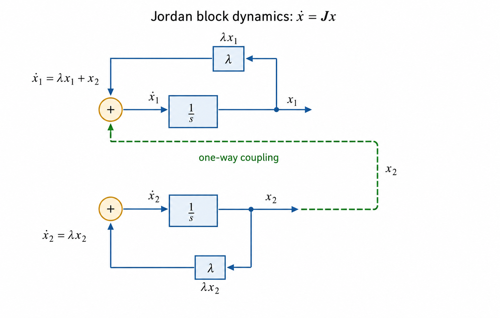

# Diagonalization, Jordan Form, and Geometric Meaning

This note summarizes the geometric and algebraic meaning of diagonalization, non-diagonalizability, Jordan form, rotation, and inner-product preservation.

---

## 1. Diagonalizable Matrices

A square matrix \(A \in \mathbb{C}^{n \times n}\) is **diagonalizable** if there exist \(n\) linearly independent eigenvectors.

Formally, this means:
\[
A = PDP^{-1}
\]
where \(D\) is diagonal and the columns of \(P\) are eigenvectors.

### Geometric interpretation
- The vector space can be decomposed into \(n\) independent directions.
- Each direction evolves **by itself**:
\[
Av_i = \lambda_i v_i
\]
- No direction influences or feeds into another.
- The transformation is a combination of independent scalings (and possibly complex rotations).

Diagonalization represents **complete decoupling of directions**.

---

## 2. Non-Diagonalizable Matrices and Jordan Blocks

A matrix is **not diagonalizable** when it does not have enough independent eigenvectors.

Over \(\mathbb{C}\), every matrix is similar to a **Jordan matrix**:
\[
A = PJP^{-1}
\]

A non-diagonalizable matrix has at least one **Jordan block** of size \(\ge 2\):
\[
J = 
\begin{bmatrix}
\lambda & 1 \\
0 & \lambda
\end{bmatrix}
\]

### Geometric interpretation
- Directions are **algebraically coupled**.
- One direction is dragged along by another.
- This coupling produces **shear-type behavior**.
- The transformation cannot be decomposed into independent one-dimensional actions.

Jordan blocks represent **intrinsic entanglement of directions**.

### Dynamical interpretation: a chain of feedback-integrator stages

The same \(2\times2\) Jordan block can be read as a continuous-time
state-space model:

\[
\dot{x}=Jx,\qquad
J=
\begin{bmatrix}
\lambda & 1\\
0 & \lambda
\end{bmatrix}.
\]

Writing the rows separately gives

\[
\dot{x}_1=\lambda x_1+x_2,\qquad
\dot{x}_2=\lambda x_2.
\]

Each state equation contains an integrator in feedback with gain \(\lambda\).
The second state evolves as an ordinary first-order mode, while \(x_2\) also
drives the equation for \(x_1\). The coupling is one-way: \(x_2\) drives
\(x_1\), not the reverse.

*The diagram is drawn in generalized-eigenvector coordinates. The
superdiagonal \(1\) is a coordinate normalization, not necessarily a literal
physical gain or physical wiring in the original system.*

For a three-state block, the same pattern continues:

\[
\dot{x}_1=\lambda x_1+x_2,\qquad
\dot{x}_2=\lambda x_2+x_3,\qquad
\dot{x}_3=\lambda x_3.
\]

The last state contributes an \(e^{\lambda t}\) term. Each preceding state
integrates a signal containing that same exponential, producing

\[
e^{\lambda t},\qquad
te^{\lambda t},\qquad
\frac{t^2}{2!}e^{\lambda t},\ldots
\]

This is the dynamical reason a defective repeated mode produces
polynomial-times-exponential terms. A diagonal matrix would instead describe
independent modal coordinates, with no one-way generalized-eigenvector
coupling.

---

## 3. Rotation and Complex Eigenvalues

Rotation does **not** come from Jordan blocks.

A real rotation matrix typically has **no real eigenvectors** (except for trivial angles).
However, over \(\mathbb{C}\), it has complex conjugate eigenvalues:
\[
\lambda = a \pm bi
\]

### Interpretation
- Complex eigenvalues correspond to **rotation or spiral motion**.
- If \(|\lambda| = 1\), the motion is pure rotation.
- If \(|\lambda| \ne 1\), the motion is a spiral (rotation + scaling).

Rotation matrices are **diagonalizable over \(\mathbb{C}\)**.

---

## 4. Real Canonical Form vs Jordan Form

When restricting to real matrices, complex eigenvalues cannot appear on the diagonal.
Instead, each conjugate pair becomes a real \(2 \times 2\) block:
\[
\begin{bmatrix}
a & -b \\
b & a
\end{bmatrix}
\]

### Important distinction
- This is **not a Jordan block**.
- It represents rotation (and possibly scaling), not shear.
- The matrix is still diagonalizable over \(\mathbb{C}\), but not over \(\mathbb{R}\).

Jordan blocks indicate **defectiveness**; real rotation blocks do not.

---

## 5. Inner Product Preservation

A matrix preserves the inner product if:
\[
\langle Ax, Ay \rangle = \langle x, y \rangle
\]

Such matrices are:
- **Orthogonal** over \(\mathbb{R}\)
- **Unitary** over \(\mathbb{C}\)

### Geometric meaning
- Lengths and angles are preserved.
- No stretching, collapsing, or shearing occurs.
- Transformations are rigid motions: rotations and reflections.

Inner-product preservation is **independent of diagonalizability**.

---

## 6. Conceptual Summary

- **Diagonalizable**: independent directions, no coupling.
- **Non-diagonalizable**: Jordan blocks, shear-type directional coupling.
- **Complex eigenvalues**: rotation or spiral behavior.
- **Real \(2 \times 2\) blocks**: rotation expressed in real coordinates.
- **Jordan blocks**: algebraic entanglement, not rotation.
- **Orthogonal / unitary matrices**: preserve inner products, but may or may not be diagonalizable over \(\mathbb{R}\).

---

## 7. One-Sentence Insight

Diagonalization means complete decoupling of directions, Jordan blocks encode unavoidable shear-type coupling, and rotation arises from complex eigenvalues rather than from Jordan defectiveness.

## Related material

- [Matrix exponential properties](../control/matrix-exponential-properties.md)
- [Solutions of linear difference and differential equations](../control/solutions-of-linear-difference-and-differential-equations.md)
- [Learning issue #15](https://github.com/longhongc/robotics-engineering-notes/issues/15)
