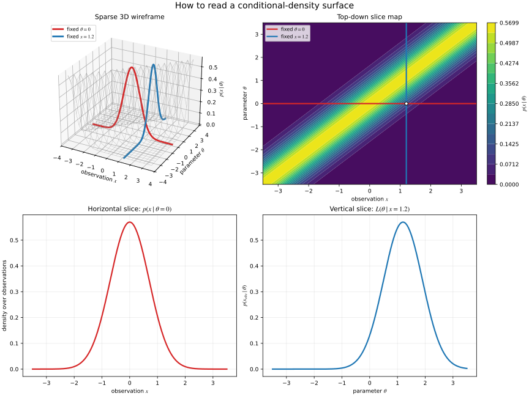
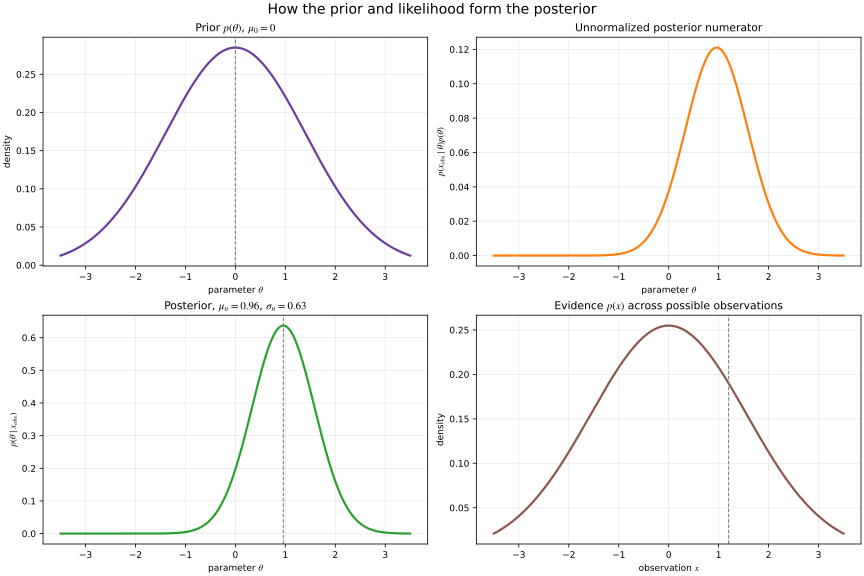

# Bayesian Updating: Prior, Likelihood, Evidence, and Posterior

Bayesian inference updates uncertainty about an unknown parameter after
observing data. Its central operation is

\[
p(\theta\mid x_{\mathrm{obs}})
=
\frac{p(x_{\mathrm{obs}}\mid\theta)p(\theta)}
{p(x_{\mathrm{obs}})}.
\]

The formula is short, but each factor has a different role. The most important
discipline is to say which variable is fixed and which variable is allowed to
vary.

## 1. The four components

Let \(\theta\) be an unknown parameter and \(x\) be a possible observation.
For continuous variables, the following expressions are probability densities;
the same ideas apply to probability mass functions in the discrete case.

### Prior

The prior \(p(\theta)\) describes uncertainty about \(\theta\) before using the
current observation. It must be normalized over \(\theta\):

\[
\int p(\theta)\,d\theta=1.
\]

The prior is not a claim that one parameter value is objectively true. It is a
model of the information or assumptions available before this update.

### Likelihood

After observing \(x_{\mathrm{obs}}\), define the likelihood as

\[
L(\theta\mid x_{\mathrm{obs}})
=
p(x_{\mathrm{obs}}\mid\theta).
\]

The likelihood is a function of \(\theta\), but it is not generally a
probability density over \(\theta\). It answers:

> For each candidate \(\theta\), how compatible is the fixed observation with
> the model?

It is still the conditional model \(p(x\mid\theta)\); the interpretation
changes because \(x\) is held at \(x_{\mathrm{obs}}\) while \(\theta\) varies.

### Evidence

The evidence, or marginal likelihood, is the prior-weighted likelihood:

\[
p(x_{\mathrm{obs}})
=
\int p(x_{\mathrm{obs}}\mid\theta)p(\theta)\,d\theta.
\]

For a fixed observation it is a single normalizing density value, not the
observation itself. It is also useful for comparing models because it measures
how well a model predicted the observed data after averaging over its prior.

### Posterior

The posterior is the updated distribution over \(\theta\):

\[
p(\theta\mid x_{\mathrm{obs}})
=
\frac{L(\theta\mid x_{\mathrm{obs}})p(\theta)}
{p(x_{\mathrm{obs}})}.
\]

It is normalized because the evidence is exactly the integral of the
unnormalized numerator:

\[
\int p(\theta\mid x_{\mathrm{obs}})\,d\theta=1.
\]

The compact mental model is therefore

\[
\text{posterior}
\propto
\text{likelihood}\times\text{prior}.
\]

The proportionality sign matters: multiplying the likelihood by the prior
gives the posterior shape, while the evidence supplies its normalization.

## 2. One conditional model, two useful slices

Consider the surface

\[
z=p(x\mid\theta)
\]

whose axes are \(x\), \(\theta\), and conditional-density height \(z\). The
surface does not rotate when we switch from probability to likelihood. We
change the slice:

- Fix \(\theta=\theta_0\) and vary \(x\). The slice
  \(p(x\mid\theta_0)\) is a probability density over possible observations and
  integrates to one over \(x\).
- Fix \(x=x_{\mathrm{obs}}\) and vary \(\theta\). The slice
  \(p(x_{\mathrm{obs}}\mid\theta)\) is the likelihood. It is a compatibility
  curve over candidate parameters and is not generally normalized over
  \(\theta\).

This distinction prevents a common mistake: seeing a bell-shaped likelihood
and treating it as though it were already a posterior distribution. A prior
must still be applied, and the product must be normalized.

The visualization is deliberately split into two figures of four panels each.
The first group explains geometry: a sparse 3D wireframe, a top-down contour map,
the horizontal fixed-\(\theta\) slice, and the vertical fixed-\(x\) slice. The
red horizontal line in the map becomes the conditional density
\(p(x\mid\theta_0)\) over observations. The blue vertical line becomes the
likelihood \(p(x_{\mathrm{obs}}\mid\theta)\) over parameters.

The figure is generated by
[generate_bayesian_updating_figure.py](https://github.com/longhongc/robotics-engineering-notes/blob/main/examples/probability/generate_bayesian_updating_figure.py).
Run it from the repository root with:

~~~bash
python examples/probability/generate_bayesian_updating_figure.py
~~~

The second figure isolates the Bayesian update: prior, unnormalized posterior
numerator, normalized posterior, and evidence as a function of possible
observations.

## 3. Worked Normal–Normal example

Use a scalar measurement model:

\[
x\mid\theta\sim\mathcal{N}(\theta,\sigma^2),
\qquad
\theta\sim\mathcal{N}(\mu_0,\tau^2).
\]

The likelihood, viewed as a function of \(\theta\) for a fixed observation, is

\[
L(\theta\mid x_{\mathrm{obs}})
=
\mathcal{N}(x_{\mathrm{obs}};\theta,\sigma^2).
\]

The prior-weighted product is proportional to a Gaussian posterior. Its
variance and mean are

\[
\tau_n^2
=
\left(\frac{1}{\tau^2}+\frac{1}{\sigma^2}\right)^{-1},
\]

\[
\mu_n
=
\tau_n^2
\left(
\frac{\mu_0}{\tau^2}
+
\frac{x_{\mathrm{obs}}}{\sigma^2}
\right).
\]

Thus,

\[
\theta\mid x_{\mathrm{obs}}
\sim
\mathcal{N}(\mu_n,\tau_n^2).
\]

The evidence is also Gaussian:

\[
x\sim\mathcal{N}\left(\mu_0,\tau^2+\sigma^2\right),
\]

so

\[
p(x_{\mathrm{obs}})
=
\mathcal{N}\left(x_{\mathrm{obs}};\mu_0,\tau^2+\sigma^2\right).
\]

This example makes the roles visible:

- the prior centers belief before measurement;
- the likelihood centers compatibility around the observed value;
- the product balances prior belief against measurement compatibility; and
- the posterior is the normalized result of that balance.

The relative widths are controlled by uncertainty. A small measurement
variance \(\sigma^2\) makes the likelihood concentrated and pulls the posterior
toward \(x_{\mathrm{obs}}\). A small prior variance \(\tau^2\) makes the prior
strong and keeps the posterior closer to \(\mu_0\).

## 4. Common interpretation errors

### Calling the likelihood a posterior

The likelihood uses the observed data but does not include prior information or
normalization over \(\theta\). It becomes part of the posterior only after
being multiplied by \(p(\theta)\) and divided by the evidence.

### Treating evidence as the data

The observation is \(x_{\mathrm{obs}}\). The evidence is \(p(x_{\mathrm{obs}})\),
the probability density assigned to that observation by the complete model.

### Assuming every slice is normalized

The conditional model is normalized over \(x\) for each fixed \(\theta\).
The likelihood slice is not automatically normalized over \(\theta\).

### Forgetting model dependence

The posterior is conditional on the chosen prior, likelihood, and observed
data. A posterior is a coherent update under a model, not an unconditional
statement of truth.

### Comparing curves without their interpretation

The prior, likelihood, unnormalized product, and posterior may be plotted on
the same horizontal parameter axis, but they need not have the same units or
normalization. Label each curve and state whether it is a density, likelihood,
or unnormalized score.

## 5. Robotics connection

In robotics, \(\theta\) might represent a landmark coordinate, calibration
parameter, sensor bias, or unknown state component, while \(x\) is a sensor
measurement. A prior can encode a previous estimate or physical knowledge. The
likelihood describes the sensor model, and the posterior becomes the estimate
used by a later planning, control, or state-estimation step.

Repeated measurements apply the same update pattern: the previous posterior
can become the next prior, provided the state-transition model and uncertainty
are handled consistently. The same distinction between likelihood, prior, and
posterior underlies the Gaussian updates used by Kalman filtering, while this
note focuses on the meaning of the Bayesian components themselves.

## Summary

\[
\boxed{
\text{posterior}
=
\frac{\text{likelihood}\times\text{prior}}{\text{evidence}}
}
\]

- \(p(\theta)\) describes pre-observation uncertainty;
- \(p(x_{\mathrm{obs}}\mid\theta)\) scores each parameter against fixed data;
- \(p(x_{\mathrm{obs}})\) normalizes the update and supports model comparison;
- \(p(\theta\mid x_{\mathrm{obs}})\) is the normalized post-observation
  uncertainty; and
- fixing different variables in \(p(x\mid\theta)\) changes the interpretation
  without changing the underlying conditional model.

## Related material

- [Least squares, MLE, MAP, and Kalman filtering](least_squares_mle_map_kalman_relationship.md)
- [Source learning issue #21](https://github.com/longhongc/robotics-engineering-notes/issues/21)
