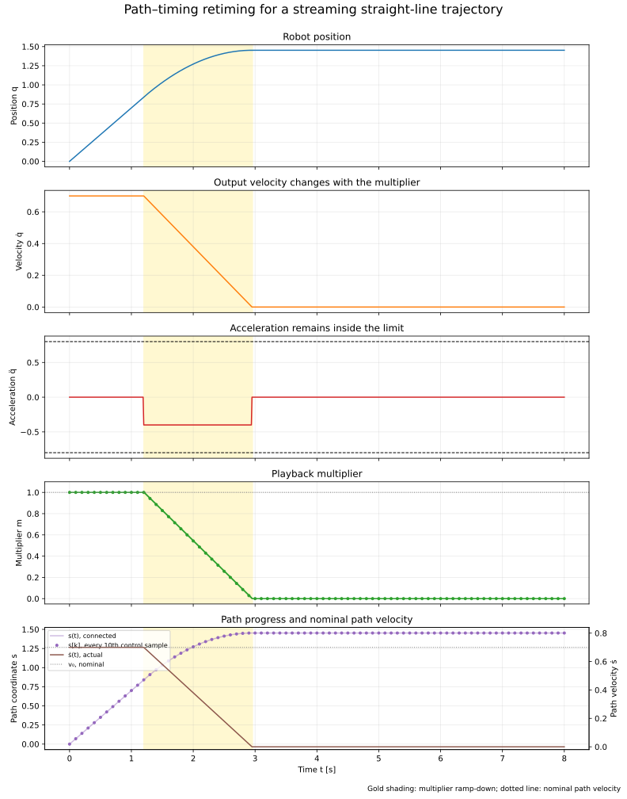
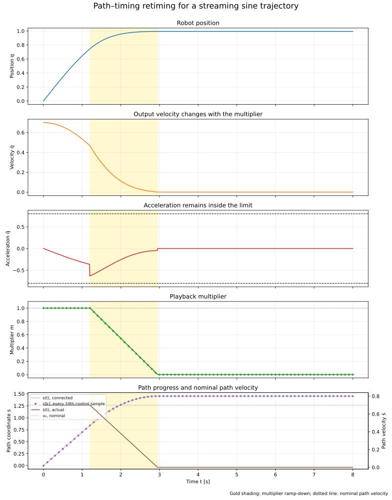

# Path–Timing Retiming for Streaming Robot Trajectories

This note explains how a streaming trajectory executor can slow down,
accelerate, stop, and resume a robot motion without changing its geometric
path. The central idea is to separate **where the robot should go** from
**how quickly it should move along that path**.

The distinction is useful for playback-like controls such as speed scaling,
controlled stopping, and resuming a motion after a temporary pause. It is not
by itself a replacement for trajectory planning, collision checking, torque
limits, or a certified emergency-stop system.

## 1. Separate the path from its timing

Let \(s\) be a scalar path coordinate and let

\[
q = q(s)
\]

describe the robot configuration along the path. The function \(q(s)\) is the
geometric path: it says which configurations are visited and in what order,
but not how long the motion takes.

The timing law is

\[
s = s(t).
\]

Together, they define the time-parameterized trajectory:

\[
q(t) = q(s(t)).
\]

Changing \(s(t)\) changes the timing while leaving \(q(s)\) unchanged. This is
the same conceptual separation used when a video player changes playback speed
without changing the sequence of frames.

The path coordinate does not have to be physical distance. It may be:

- normalized path progress, such as \(s \in [0,1]\);
- arc length or another geometric parameter; or
- a fractional index into a stored sequence of trajectory waypoints.

The meaning of \(s\) determines the units of the nominal path velocity, but the
separation between path and timing is the same.

## 2. What changes during retiming

Assume a nominal path-coordinate velocity \(v_0\) and a dimensionless playback
multiplier \(m\). The actual path velocity is

\[
\dot{s} = m v_0.
\]

For normal playback, \(m=1\). A half-speed command uses \(m=0.5\), and a
controlled stop ramps \(m\) toward zero.

The control loop does not need to change its frequency. With a fixed control
period \(\Delta t\), a streaming executor can update the path coordinate as

\[
s_{k+1} = s_k + m_k v_0 \Delta t.
\]

The executor then evaluates or interpolates the path at \(s_{k+1}\) and sends
the resulting command at the next fixed-rate control cycle.

For a stored path, \(s_k\) may be fractional. If \(s_k=12.4\), for example,
the command is obtained by interpolating between waypoints 12 and 13. The
intermediate command is not a new geometric path; it is a point on the same
path evaluated at a different progress value.

A minimal implementation has the following structure:

```python
for each_control_cycle:
    multiplier = ramp_toward(multiplier, target_multiplier)
    path_coordinate += multiplier * nominal_path_velocity * control_period
    command = interpolate(stored_path, path_coordinate)
    send(command)
```

The full executable example that generated the figures in this note is
[`generate_path_timing_figure.py`](https://github.com/longhongc/robotics-engineering-notes/blob/main/examples/trajectory-generation/generate_path_timing_figure.py).

## 3. The derivative relationships

Applying the chain rule gives the joint velocity:

\[
\dot{q} = q'(s)\dot{s}.
\]

Differentiating again gives the joint acceleration:

\[
\ddot{q} = q''(s)\dot{s}^{2} + q'(s)\ddot{s}.
\]

The two terms have different meanings:

- \(q''(s)\dot{s}^{2}\) is acceleration caused by the curvature of the path
  while moving along it;
- \(q'(s)\ddot{s}\) is acceleration caused by changing the timing or playback
  speed.

If \(v_0\) is constant, then

\[
\ddot{s} = v_0\dot{m}.
\]

Therefore, the multiplier ramp cannot be selected independently of the path.
The same multiplier change can be harmless on one part of a path and violate
an acceleration limit on another part.

## 4. Why the control loop stays fixed

Slowing a trajectory is different from lowering the control-loop frequency.
The executor should continue to run every \(\Delta t\) seconds so that sensing,
feedback, communication, and lower-level control remain synchronized.

Only the progress update changes:

\[
\text{normal speed: } s_{k+1}-s_k = v_0\Delta t,
\]

\[
\text{half speed: } s_{k+1}-s_k = 0.5v_0\Delta t.
\]

At half speed, the next coordinate frequently lies between stored waypoints.
Interpolation is what turns fractional progress into a useful command while
preserving the fixed control rate.

## 5. The straight-path example

The clearest first example is a one-dimensional straight path:

\[
q(s)=s.
\]

For this path,

\[
q'(s)=1, \qquad q''(s)=0,
\]

so the acceleration relationship becomes

\[
\ddot{q}=\ddot{s}.
\]

If the scalar output acceleration must satisfy

\[
|\ddot{q}| \leq a_{\max},
\]

then the timing law can use the simple bound

\[
|\ddot{s}| \leq a_{\max}.
\]

With constant \(v_0\), this is also a bound on the multiplier rate:

\[
|\dot{m}| \leq \frac{a_{\max}}{v_0}.
\]

The figure shows normal playback followed by a bounded ramp-down. The dots
mark every tenth control sample so the discrete update pattern remains visible
without making the plot unreadable.



The important observations are:

- the control period remains fixed;
- the multiplier changes over several cycles instead of jumping to zero;
- path progress continues during the ramp and stops only when the multiplier
  reaches zero; and
- the output acceleration stays within the displayed limit.

## 6. Curved paths require the path-curvature term

For a curved scalar path such as

\[
q(s)=A\sin(ks),
\]

the acceleration is

\[
\ddot{q} = -Ak^2\sin(ks)\dot{s}^{2}
           + Ak\cos(ks)\ddot{s}.
\]

A conservative scalar bound is

\[
|q''(s)|\dot{s}^{2} + |q'(s)||\ddot{s}| \leq a_{\max}.
\]

When the remaining margin is positive and \(q'(s)\) is not zero, this gives
the conservative available timing acceleration

\[
|\ddot{s}|
\leq
\frac{a_{\max}-|q''(s)|\dot{s}^{2}}{|q'(s)|}.
\]

This bound is intentionally conservative because it uses the triangle
inequality. A production retimer should account for all constrained joints,
the signs of the terms, jerk, actuator limits, controller behavior, and the
available stopping distance.

The sine-path figure makes the extra curvature term visible:



The sine example is an extension, not the preferred starting point. Its output
acceleration can change even when the multiplier is constant because the path
itself has curvature.

## 7. Controlled stopping is not an emergency stop

A controlled retimed stop sets the target multiplier to zero and ramps toward
it while respecting motion constraints. It is appropriate when the system has
time and distance to decelerate normally.

For an approximately constant path deceleration magnitude \(a_s\), the ideal
stopping distance is

\[
d_{\text{stop}} = \frac{\dot{s}^{2}}{2a_s}.
\]

The executor must check that enough path remains before commanding a stop. A
multiplier ramp that satisfies an instantaneous acceleration limit can still be
unsafe if the robot reaches an obstacle, joint limit, or path endpoint before
stopping.

An emergency stop is a separate safety function. It may use independent
hardware, lower-level safety controllers, braking logic, or a different
acceptance standard. A normal retiming ramp must not be presented as a
certified emergency-stop mechanism.

## 8. Common failure modes

### Lowering the control-loop frequency

This can disrupt feedback timing and communication. Keep the loop frequency
fixed and change path progress instead.

### Changing the waypoint index without interpolation

Fractional progress without interpolation can produce discontinuous commands
or silently round away the requested speed change.

### Applying an instantaneous multiplier change

A jump from \(m=1\) to \(m=0\) implies a large timing acceleration. The
resulting command may violate joint acceleration, jerk, torque, or controller
constraints.

### Treating the multiplier as a visual easing parameter

An easing curve is not automatically physically valid. The multiplier profile
must be checked against the robot and controller constraints.

### Ignoring path curvature

On a curved path, \(q''(s)\dot{s}^{2}\) can consume most of the available
acceleration budget before retiming acceleration is applied.

### Confusing a controlled stop with an emergency stop

The two mechanisms have different timing assumptions, guarantees, and safety
responsibilities.

## 9. Implementation checklist

For a streaming implementation, verify that it:

- keeps the control period fixed;
- stores path progress with enough precision for fractional waypoints;
- interpolates the path at the current progress value;
- ramps the multiplier rather than changing it instantaneously;
- derives timing limits from joint-space constraints;
- checks stopping distance and path endpoints;
- handles pause, resume, and repeated stop requests consistently; and
- tests position continuity, velocity behavior, acceleration limits, and
  interpolation near waypoint boundaries.

The example script checks the scalar acceleration bound for its configured
straight and sine paths. It does not replace multi-joint simulation or
hardware validation.

## 10. Summary

The reusable mental model is:

\[
\boxed{q(t)=q(s(t))}
\]

- \(q(s)\) is the geometric path;
- \(s(t)\) is the timing law;
- the fixed-rate executor advances \(s\) by a multiplier-scaled amount each
  cycle;
- interpolation converts fractional progress into commands; and
- the multiplier ramp must satisfy the path-dependent motion constraints.

This separation lets a streaming executor change playback speed without
replanning the geometric path, while making the physical limits explicit.

## Related material

- [Control](../control/index.md)
- [Optimization](../optimization/index.md)
- [Robot modeling](../modeling/index.md)
- [Source learning issue #3](https://github.com/longhongc/robotics-engineering-notes/issues/3)
